# 🏠 HouseHunt – Full Stack House Rental Platform

HouseHunt is a full-stack house rental platform developed using the **MERN Stack**. The platform provides a seamless experience for property owners to list rental properties, renters to discover and book houses, and administrators to manage the complete rental ecosystem.

The application follows a **role-based architecture** with three different user roles:

- 👤 Renter
- 🏡 Owner
- 👨‍💼 Admin

Unlike separate admin applications, HouseHunt uses **a single React application** with protected routes and role-based access control for all users.

---

# ✨ Features

## 👤 Renter

- Secure User Registration & Login
- Browse Available Properties
- View Property Details
- Multiple Property Image Gallery
- Search Rental Properties
- Submit Booking Requests
- View Booking History
- Track Booking Status

---

## 🏡 Owner

- Secure Owner Authentication
- Owner Dashboard
- Add Rental Properties
- Upload Multiple Property Images
- Edit Existing Properties
- Delete Properties
- View Tenant Booking Requests
- Approve / Reject Bookings
- Dashboard Analytics

---

## 👨‍💼 Admin

- Secure Admin Dashboard
- View All Users
- View All Properties
- View All Bookings
- Platform Monitoring
- Rental Statistics

---

# 🧰 Technology Stack

## Frontend

- React.js
- React Router DOM
- Context API
- Axios
- CSS3
- Vite

---

## Backend

- Node.js
- Express.js
- MongoDB
- Mongoose
- JWT Authentication
- Multer
- bcrypt.js

---

# 📸 Project Screenshots

> Create a folder named **screenshots** inside the project root and place all screenshots there.

---

### 🏠 Landing Page

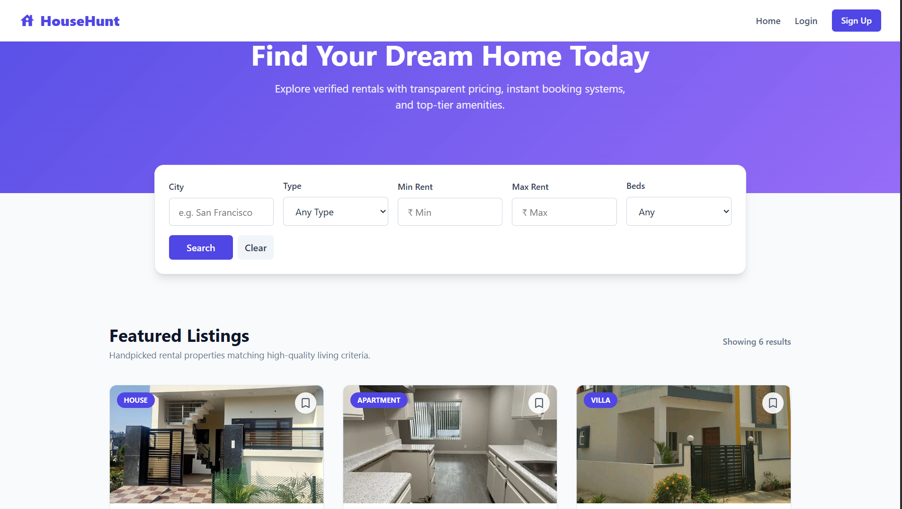

---

### 🔐 Login Page

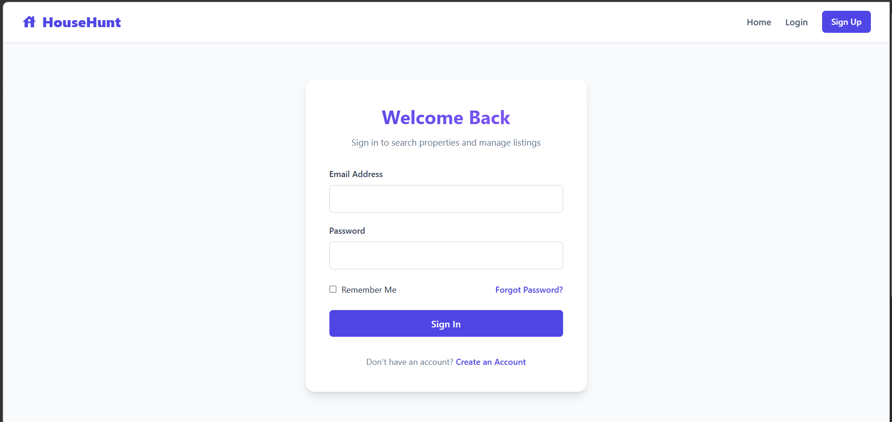

---

### 📝 Register Page

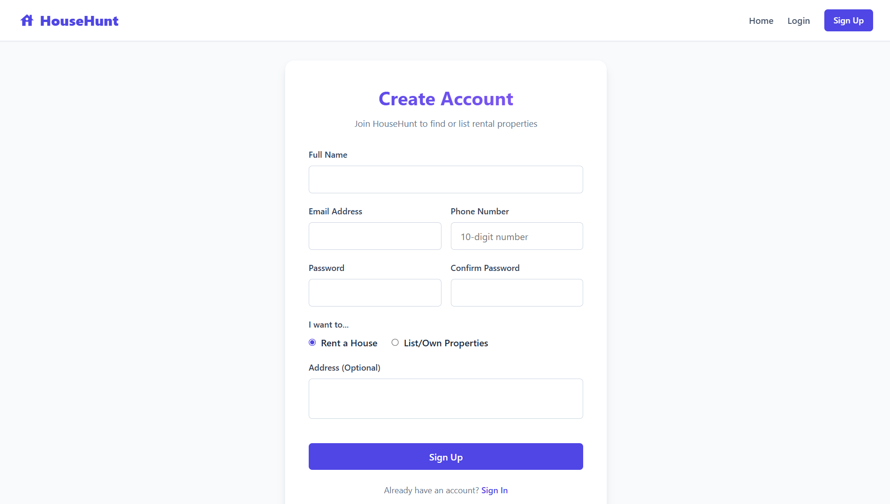

---

### 🏡 Owner Dashboard

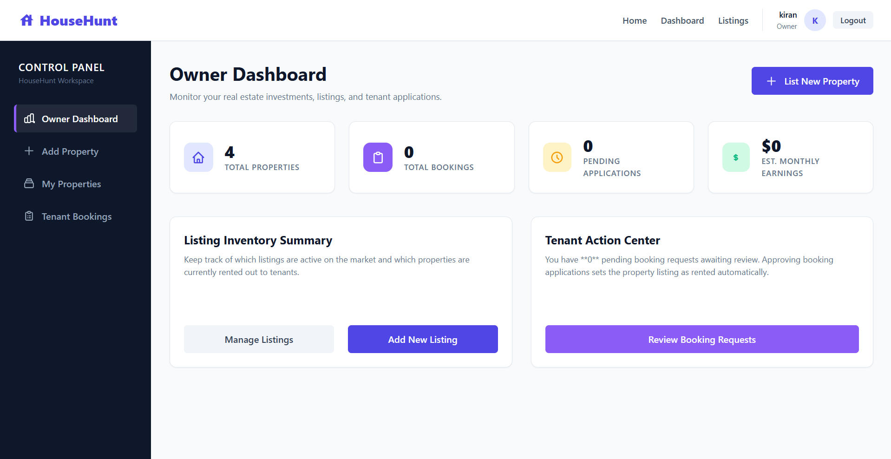

---

### ➕ Add Property

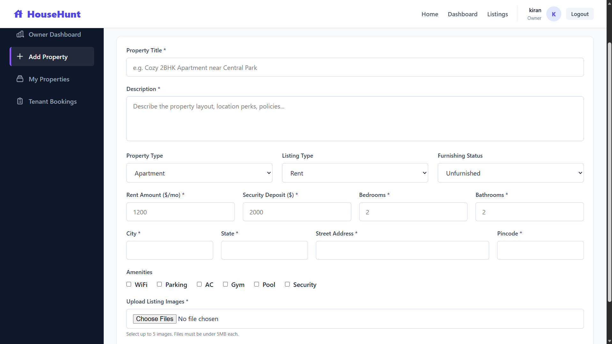

---

### 📂 My Properties

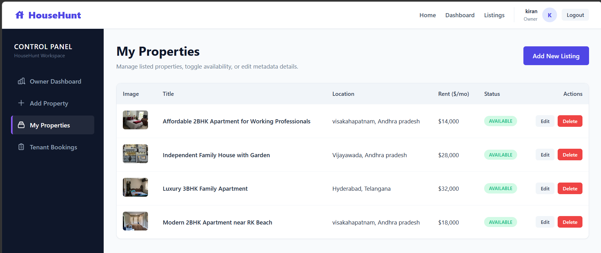

---

### 📋 Owner Bookings

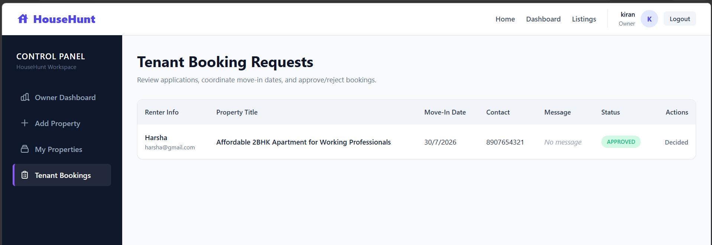

---

### 🏘 Browse Properties

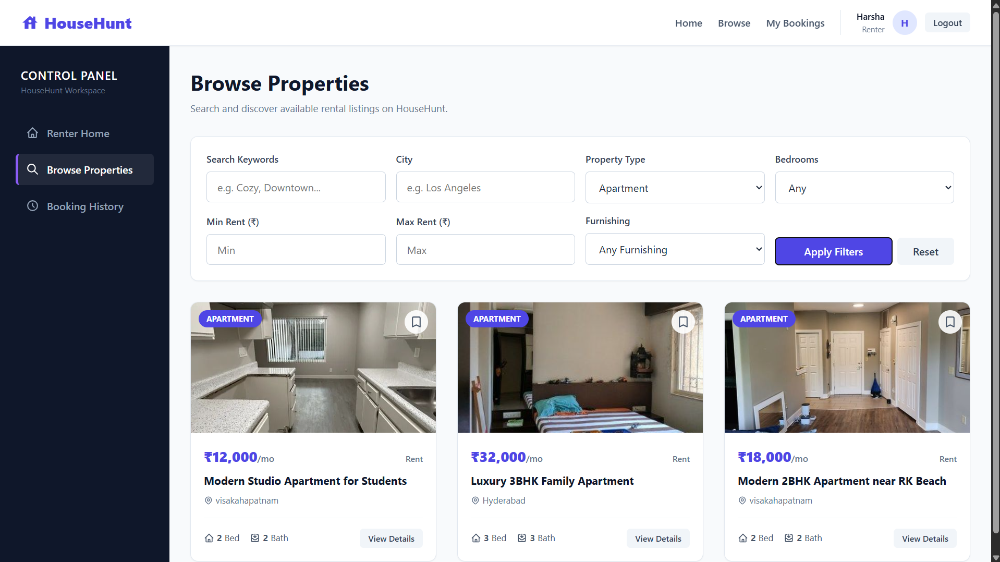

---

### 🏠 Property Details

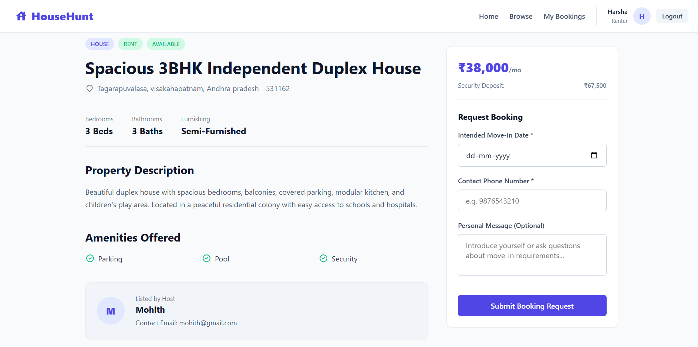

---

### 📅 My Bookings

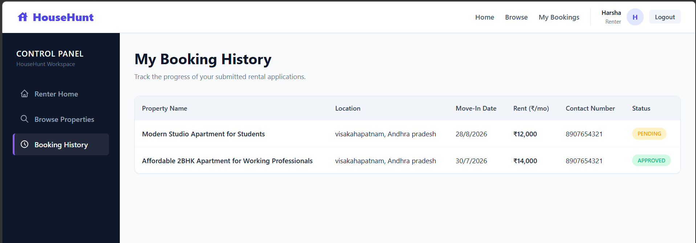

---

### 👨‍💼 Admin Dashboard

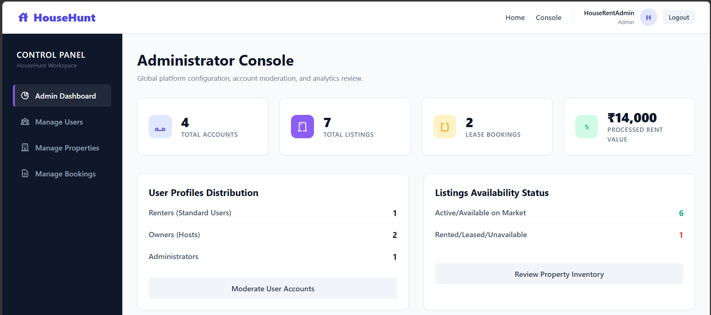

---

### 👥 Manage Users

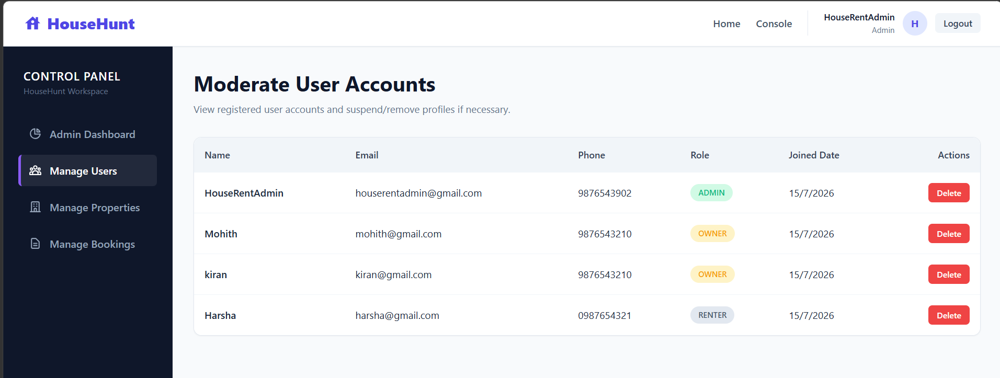

---

### 🏡 Manage Properties

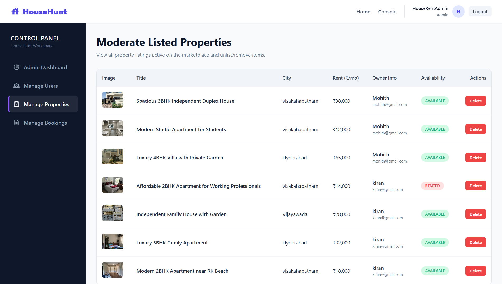

---

### 📋 Manage Bookings

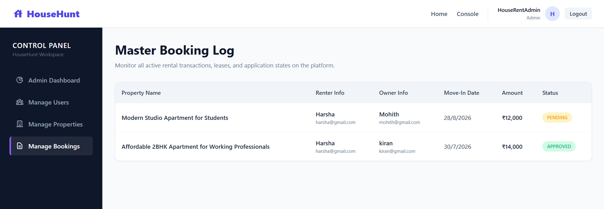

---

# 🚀 Key Highlights

- MERN Stack Architecture
- JWT Authentication
- Role Based Authorization
- Protected Routes
- Property Listing Management
- Property Booking System
- Booking Approval Workflow
- Multiple Image Upload
- Dashboard Analytics
- RESTful APIs
- Responsive User Interface

---

# 📁 Project Structure

```text
HouseHunt
│
├── backend
│   ├── config
│   ├── controllers
│   ├── middlewares
│   ├── models
│   ├── routes
│   ├── uploads
│   ├── utils
│   ├── server.js
│   └── package.json
│
├── frontend
│   ├── public
│   ├── src
│   │
│   ├── components
│   ├── context
│   ├── services
│   ├── modules
│   │   ├── admin
│   │   ├── common
│   │   └── user
│   │       ├── owner
│   │       └── renter
│   │
│   ├── App.jsx
│   ├── main.jsx
│   └── package.json
│
├── screenshots
│   ├── home.png
│   ├── login.png
│   ├── register.png
│   ├── owner-dashboard.png
│   ├── add-property.png
│   ├── my-properties.png
│   ├── owner-bookings.png
│   ├── browse-properties.png
│   ├── property-details.png
│   ├── my-bookings.png
│   ├── admin-dashboard.png
│   ├── manage-users.png
│   ├── manage-properties.png
│   └── manage-bookings.png
│
└── README.md
```
---

# ⚙️ Environment Variables

Create a `.env` file inside the **backend** directory and add the following:

```env
PORT=8000
NODE_ENV=development
MONGO_URI=mongodb://127.0.0.1:27017/househunt
JWT_SECRET=your_jwt_secret_key
JWT_EXPIRE=24h
COOKIE_EXPIRE=1
CLIENT_URL=http://localhost:5173
```

---

Create another `.env` file inside the **frontend** directory.

```env
VITE_API_URL=http://localhost:8000/api
```

---

# 💻 Running the Project Locally

## 1️⃣ Clone the Repository

```bash
git clone https://github.com/yourusername/HouseHunt.git

cd HouseHunt
```

---

## 2️⃣ Backend Setup

Navigate to the backend folder.

```bash
cd backend
```

Install dependencies.

```bash
npm install
```

Start the backend server.

```bash
npm run dev
```

The backend server will run at:

```
http://localhost:8000
```

---

## 3️⃣ Frontend Setup

Open a new terminal.

Navigate to the frontend folder.

```bash
cd frontend
```

Install dependencies.

```bash
npm install
```

Run the React application.

```bash
npm run dev
```

The frontend will run at:

```
http://localhost:5173
```

---

## 4️⃣ MongoDB

Start MongoDB locally before running the backend.

Default Database

```
househunt
```

Default Connection

```
mongodb://127.0.0.1:27017/househunt
```

MongoDB Compass can also be used for managing the database.

---

# 🔐 Authentication & Authorization

The application implements **JWT Authentication** with **Role-Based Authorization**.

### Supported Roles

- 👤 Renter (User)
- 🏡 Owner
- 👨‍💼 Admin

### Access Control

#### Renter

- Register & Login
- Browse Properties
- View Property Details
- Book Properties
- View Booking History

#### Owner

- Login
- Add Properties
- Update Properties
- Delete Properties
- View Tenant Bookings
- Approve / Reject Booking Requests

#### Admin

- View All Users
- View All Properties
- View All Bookings
- Monitor Platform Activities

All protected APIs are secured using JWT Middleware.

---

# 📖 Learning Outcomes

This project helped in understanding and implementing:

- MERN Stack Application Development
- REST API Design
- MongoDB Schema Design
- JWT Authentication
- Role-Based Access Control
- File Upload using Multer
- React Routing
- Context API
- CRUD Operations
- Express Middleware
- Backend Validation
- Responsive UI Design

---

# 🚀 Future Enhancements

- Property Wishlist
- Advanced Property Filters
- Google Maps Integration
- Online Rent Payment Gateway
- Email Notifications
- Property Reviews & Ratings
- Chat Between Owner & Renter
- Recently Viewed Properties
- Property Recommendation System

---

# 📌 Project Workflow

```text
Owner
   │
   ▼
Add Property
   │
   ▼
Property Listed
   │
   ▼
Renter Browses Property
   │
   ▼
Booking Request
   │
   ▼
Owner Reviews Request
   │
   ▼
Approve / Reject
   │
   ▼
Booking Status Updated
   │
   ▼
Admin Monitors Entire Platform
```

---

# 📄 License

This project was developed for educational purposes as part of the **SkillWallet Full Stack MERN Development Program**.

---